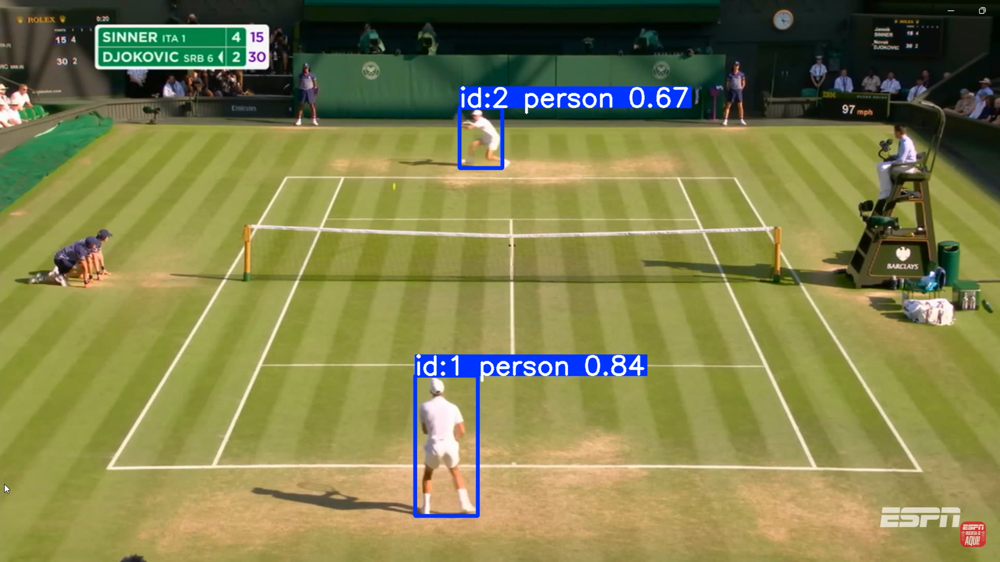
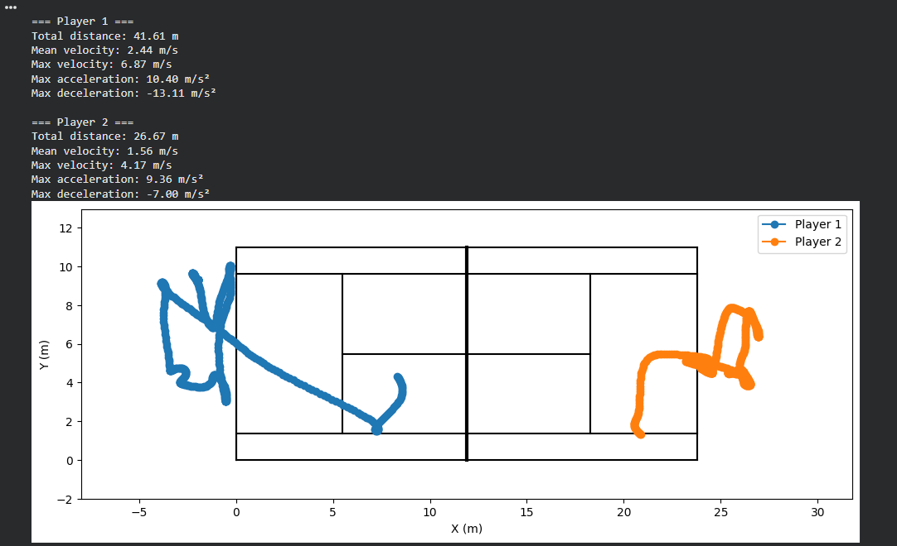

# Tennis Player Tracking System using YOLO, ByteTrack, and Homography

This repository implements a computer vision pipeline for tennis player tracking and real-world kinematic analysis using deep learning–based object detection, multi-object tracking, and homography-based coordinate transformation.

The system processes video input to extract player trajectories and transform image-space coordinates into real-world court coordinates, enabling quantitative motion analysis including displacement, velocity, and acceleration.

This implementation extends a research-oriented tracking base into a more robust, reproducible, and engineering-focused sports tracking system.

---

# Core Features

• Player detection using YOLO (Ultralytics)  
• Multi-object tracking using ByteTrack  
• Tennis court keypoint detection  
• Homography transformation (image → real-world coordinates)  
• Real-world trajectory reconstruction  

Kinematic analysis:

• Distance traveled  
• Velocity estimation  
• Acceleration estimation  
• Time-resolved trajectory analysis  

Additional engineering features:

• Structured pipeline design  
• Persistent storage integration (Google Drive compatible)  
• Reproducible execution environment  

---

# System Architecture

Pipeline overview:

Video Input  
↓  
YOLO Player Detection  
↓  
ByteTrack Multi-Object Tracking  
↓  
Court Keypoint Detection  
↓  
Homography Computation  
↓  
Coordinate Transformation  
↓  
Kinematic Analysis  
↓  
Structured Data Output  

---

# Mathematical Foundation

This system uses planar homography to map image coordinates to real-world court coordinates:

x_real = H · x_image

Where:

• H = homography matrix  
• x_image = pixel coordinates  
• x_real = real-world coordinates (meters)  

This enables physically meaningful motion analysis.

---

# Engineering Contributions

This repository introduces the following engineering and modeling extensions:

Infrastructure Engineering:

• Google Drive integration  
• Reproducible file path management  
• Structured pipeline architecture  

Tracking Improvements:

• Improved tracking consistency  
• Robust trajectory handling  
• Improved tracking stability  

Homography and Geometric Modeling:

• Robust court keypoint handling  
• Improved homography computation pipeline  
• Reliable coordinate normalization  

Kinematic Modeling (Original Contribution):

• Real-world distance computation  
• Velocity estimation  
• Acceleration estimation  
• Trajectory reconstruction  

Pipeline Robustness:

• Error handling improvements  
• Improved execution stability  

---

# Technologies Used

Python 3.x  
YOLO — Ultralytics  
ByteTrack  
OpenCV  
NumPy  
Pandas  
PyTorch  
Google Colab  

---

# Repository Structure

```
tennis-player-tracking/
│
├── notebook/
│   └── tennis_tracking_performance.ipynb
│
├── assets/
│   ├── tracking_box.png
│   ├── tracking_homography.png
│   └── metrics_trajetory.png
│
├── requirements.txt
└── README.md
```
---

# Pipeline Visualization and Example Outputs

This section presents the main processing stages and corresponding outputs of the tennis player tracking and kinematic reconstruction pipeline.

The system combines deep learning–based detection, multi-object tracking, geometric transformation via homography, and temporal filtering to reconstruct real-world player trajectories.

---
#Stage 1 — Player Detection and Multi-Object Tracking

This stage uses YOLO (Ultralytics) for player detection and ByteTrack for persistent ID assignment across frames.

Each player is detected in image space and assigned a stable tracking identity, enabling continuous trajectory reconstruction.

<p align="center">  </p>

Key characteristics:

• Robust player detection under broadcast camera conditions
• Persistent identity tracking across frames
• Bounding-box–based ground contact proxy (bottom-center heuristic)
• Foundation for trajectory extraction

---
#Stage 2 — Court Keypoint Detection and Motion Trail Visualization

This stage overlays detected court keypoints and renders player motion using a temporal trail visualization.

The trail rendering provides qualitative verification of tracking stability and motion continuity.

<p align="center">  </p>

Key characteristics:

• Court geometry reconstruction
• Spatial reference validation
• Motion trail rendering with temporal decay
• Tracking stability visualization

Engineering relevance:

This stage enables verification of geometric consistency prior to homography-based transformation.

---
# Stage 3 — Real-World Coordinate Transformation and Trajectory Reconstruction

Using planar homography, player positions are mapped from image coordinates (pixels) into real-world coordinates (meters).

After coordinate transformation, the system applies interpolation and temporal filtering to reconstruct physically meaningful trajectories.

<p align="center">  </p>

This enables computation of kinematic performance metrics.

Computed metrics include:

• Total distance traveled
• Mean velocity
• Maximum velocity
• Maximum acceleration
• Maximum deceleration

Engineering components applied:

• Homography transformation
• Missing data interpolation
• Butterworth low-pass temporal filtering
• Noise reduction and trajectory stabilization

---

#Output Data Products

For each analyzed video, the system generates:

Structured outputs:

• Processed visualization video with tracked players
• Real-world trajectory plot
• CSV file containing reconstructed coordinates
• CSV file containing computed kinematic metrics

Directory structure:
```
results/
└── <video_name>/
    ├── tracked_video.mp4
    ├── trajectory.png
    ├── real_coordinates.csv
    ├── filtered_coordinates.csv
    └── metrics.csv
```
---

#Scientific and Engineering Significance

This pipeline converts raw video data into physically interpretable biomechanical and performance metrics.

Applications include:

• Sports performance analysis
• Athlete monitoring systems
• Biomechanics research
• Sports analytics platforms
• Computer vision research

---

# Installation

Clone repository:

```bash
git clone https://github.com/peterson-scbr/tennis-player-tracking.git
cd tennis-player-tracking
```

Install dependencies:

```bash
pip install -r requirements.txt
```

Open notebook:

```bash
jupyter notebook notebook/tennis_tracking.ipynb
```
---

# Download required data (Google Drive)

Download the project data and models from:

Google Drive folder:

https://drive.google.com/drive/folders/1UtBqFwioyK1UMoWDczqu9E0g-zUhMqc5

Download or add the folder to your Google Drive, then ensure it is located at:

Required structure:
```
MyDrive/
└── tennis_analysis/
    ├── input_videos/
    ├── models/
    ├── results/
```
The notebook expects the following path:

/content/drive/MyDrive/tennis_analysis/

Do not rename folders.

---

# Run in Google Colab
Mount Google Drive:
```
from google.colab import drive
drive.mount('/content/drive')
```
Then open and run:
notebook/tennis_tracking_performance.ipynb

---

# Attribution

This project builds upon the open-source tennis analysis framework developed by Muhammad Moin Faisal:

https://github.com/MuhammadMoinFaisal/tennis_analysis

The original repository provides core modules for:

• Player detection and tracking  
• Court keypoint detection  
• Tracking utilities and supporting infrastructure  

This repository extends the original implementation with additional engineering and modeling features, including:

• Structured Google Drive integration  
• Homography-based real-world coordinate transformation  
• Kinematic analysis (distance, velocity, acceleration)  
• Robust trajectory filtering and smoothing  
• Reproducible pipeline architecture  

Original credit belongs to the original author for detection and tracking modules.

---

# Author

Peterson Antonio  
Sports Scientist & Developer  
Brazil
